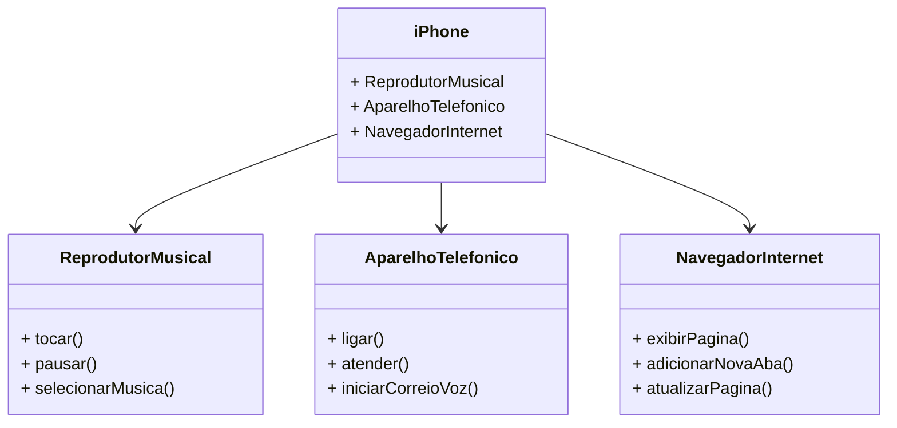

### Diagrama de classe

```mermaid
classDiagram
  class iPhone {
    + ReprodutorMusical
    + AparelhoTelefonico
    + NavegadorInternet
  }

  class ReprodutorMusical {
    + tocar()
    + pausar()
    + selecionarMusica()
  }

  class AparelhoTelefonico {
    + ligar()
    + atender()
    + iniciarCorreioVoz()
  }

  class NavegadorInternet {
    + exibirPagina()
    + adicionarNovaAba()
    + atualizarPagina()
  }

  iPhone --> ReprodutorMusical
  iPhone --> AparelhoTelefonico
  iPhone --> NavegadorInternet
```
